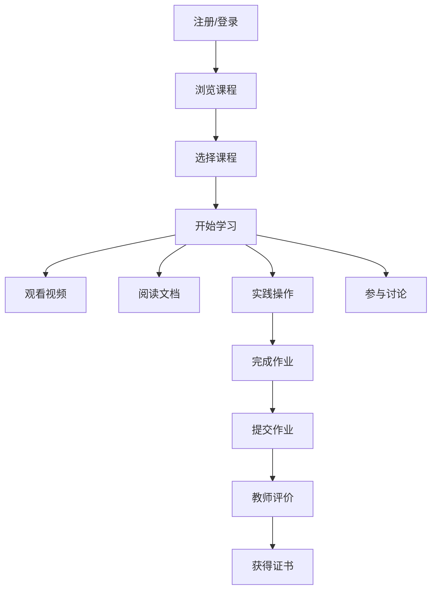

## 1. Product Overview
基于Python的数据分析在线教育平台，专为商务数据分析与应用专业学生设计，提供系统化的数据分析课程和实践环境。
- 解决商务数据分析专业学生缺乏系统化学习资源和实践机会的问题，帮助他们掌握数据分析技能。
- 目标市场为高校商务数据分析专业学生，提供从基础到进阶的完整学习路径。

## 2. Core Features

### 2.1 User Roles
| 角色 | 注册方式 | 核心权限 |
|------|----------|----------|
| 学生 | 邮箱注册 | 浏览课程、观看视频、完成作业、参与讨论 |
| 教师 | 邀请码注册 | 发布课程、管理作业、评价学生、参与讨论 |
| 管理员 | 系统分配 | 管理用户、监控平台运行、配置系统参数 |

### 2.2 Feature Module
1. **首页**：平台介绍、课程分类、推荐课程、最新动态
2. **课程页面**：课程列表、课程详情、章节内容、视频播放
3. **学习中心**：个人学习进度、已完成课程、待完成作业
4. **实践环境**：Python在线编辑器、数据分析工具、实验项目
5. **社区讨论**：课程讨论、问题解答、学习心得分享
6. **成就系统**：学习成就、徽章、排行榜

### 2.3 Page Details
| 页面名称 | 模块名称 | 功能描述 |
|---------|---------|----------|
| 首页 | 平台介绍 | 展示平台定位、核心功能和优势，吸引用户注册 |
| 首页 | 课程分类 | 按难度、主题、技术栈等维度分类展示课程 |
| 首页 | 推荐课程 | 根据用户兴趣和学习历史推荐相关课程 |
| 首页 | 最新动态 | 发布平台更新、课程上线等最新信息 |
| 课程页面 | 课程列表 | 展示所有课程，支持筛选和排序功能 |
| 课程页面 | 课程详情 | 展示课程大纲、讲师信息、学习目标等 |
| 课程页面 | 章节内容 | 展示课程章节结构，支持视频、文档等多种内容形式 |
| 课程页面 | 视频播放 | 提供高清视频播放功能，支持倍速、字幕等 |
| 学习中心 | 学习进度 | 展示用户所有课程的学习进度和完成情况 |
| 学习中心 | 已完成课程 | 展示用户已完成的课程和获得的证书 |
| 学习中心 | 待完成作业 | 展示用户需要完成的作业和截止日期 |
| 实践环境 | Python在线编辑器 | 提供基于浏览器的Python代码编辑和运行环境 |
| 实践环境 | 数据分析工具 | 集成常用数据分析工具，如Pandas、Matplotlib等 |
| 实践环境 | 实验项目 | 提供真实数据分析案例，让学生实践所学知识 |
| 社区讨论 | 课程讨论 | 针对特定课程的讨论区，方便师生交流 |
| 社区讨论 | 问题解答 | 集中解答学生在学习过程中遇到的问题 |
| 社区讨论 | 学习心得分享 | 鼓励学生分享学习心得和经验 |

## 3. Core Process
### 学生学习流程
1. 学生注册并登录平台
2. 在首页浏览推荐课程或通过分类查找感兴趣的课程
3. 进入课程详情页，了解课程内容和要求
4. 开始学习课程，观看视频，阅读文档
5. 在实践环境中完成实验和作业
6. 参与社区讨论，提问和分享
7. 完成课程后获得证书

### 教师教学流程
1. 教师通过邀请码注册并登录平台
2. 创建新课程，设置课程大纲和内容
3. 上传视频、文档等教学材料
4. 布置作业和实验项目
5. 查看学生学习进度和作业完成情况
6. 评价学生作业并提供反馈
7. 参与课程讨论，回答学生问题

## 4. User Interface Design
### 4.1 Design Style
- 主色调：蓝色(#165DFF)和白色(#FFFFFF)，辅助色：浅灰(#F5F7FA)和深灰(#333333)
- 按钮风格：圆角矩形，有轻微的阴影效果
- 字体：无衬线字体，主标题18-24px，副标题16px，正文14px
- 布局风格：卡片式布局，清晰的层次结构，适当的留白
- 图标风格：线性图标，简洁现代

### 4.2 Page Design Overview
| 页面名称 | 模块名称 | UI元素 |
|---------|---------|--------|
| 首页 | 平台介绍 | 大型hero区域，包含平台标语和核心价值，背景使用渐变效果 |
| 首页 | 课程分类 | 网格布局的分类卡片，每个分类有对应的图标和简短描述 |
| 首页 | 推荐课程 | 横向滚动的课程卡片，包含课程封面、标题、难度和评分 |
| 首页 | 最新动态 | 时间线形式的动态列表，显示最新的平台更新 |
| 课程页面 | 课程列表 | 响应式网格布局的课程卡片，支持筛选和排序控件 |
| 课程页面 | 课程详情 | 左侧课程大纲导航，右侧课程内容区域，顶部课程信息栏 |
| 课程页面 | 章节内容 | 视频播放器，文档查看器，代码示例区域 |
| 学习中心 | 学习进度 | 环形进度条显示总体学习情况，列表展示各课程进度 |
| 学习中心 | 已完成课程 | 网格布局的证书卡片，显示课程名称和完成时间 |
| 学习中心 | 待完成作业 | 列表形式展示作业名称、截止日期和状态 |
| 实践环境 | Python在线编辑器 | 代码编辑区域，运行按钮，输出结果区域 |
| 实践环境 | 数据分析工具 | 工具选择面板，参数配置区域，结果可视化区域 |
| 实践环境 | 实验项目 | 项目描述，步骤指南，提交结果区域 |
| 社区讨论 | 课程讨论 | 帖子列表，回复区域，点赞和评论功能 |
| 社区讨论 | 问题解答 | 问题分类标签，搜索功能，最佳答案标记 |
| 社区讨论 | 学习心得分享 | 文章列表，阅读量和评论数统计，标签筛选 |
| 成就系统 | 学习成就 | 展示用户获得的成就和完成的里程碑 |
| 成就系统 | 徽章 | 展示用户获得的徽章及其获取条件 |
| 成就系统 | 排行榜 | 显示用户在学习、贡献等方面的排名 |

### 4.3 Responsiveness
- 设计采用桌面优先原则，同时支持平板和移动设备
- 在移动设备上，导航栏将折叠为汉堡菜单
- 课程卡片和其他网格布局会根据屏幕宽度自动调整列数
- 视频播放器和编辑器会自适应屏幕宽度
- 触摸设备上的交互元素会适当增大，以提高可用性

### 4.4 3D Scene Guidance
- 不适用，本项目为教育平台，不需要3D场景