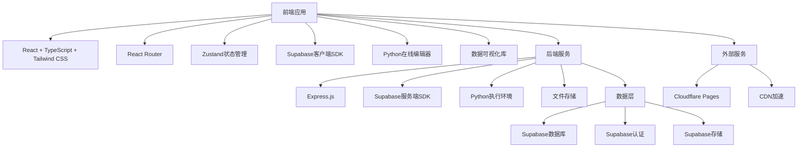
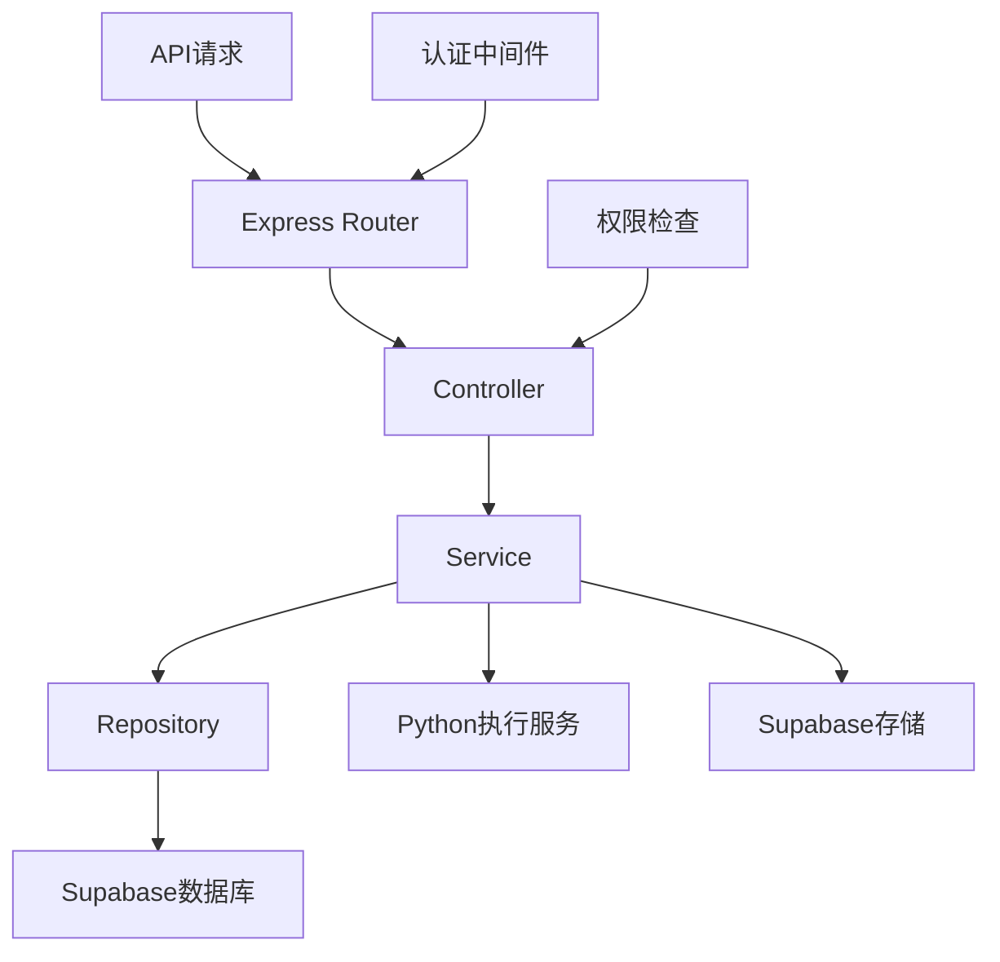
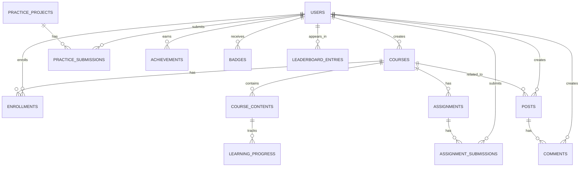

## 1. Architecture Design


## 2. Technology Description
- 前端：React@18 + TypeScript + Tailwind CSS + Vite
- 初始化工具：vite-init
- 后端：Express.js + Node.js
- 数据库：Supabase (PostgreSQL)
- 认证：Supabase Auth
- 存储：Supabase Storage
- 部署：Cloudflare Pages
- 其他工具：
  - React Router：页面路由
  - Zustand：状态管理
  - Monaco Editor：Python在线编辑器
  - D3.js/Chart.js：数据可视化
  - Python执行环境：用于运行学生代码

## 3. Route Definitions
| 路由 | 用途 |
|------|------|
| / | 首页 |
| /courses | 课程列表页 |
| /courses/:id | 课程详情页 |
| /courses/:id/contents/:contentId | 课程内容页 |
| /learning-center | 学习中心 |
| /practice | 实践环境 |
| /practice/editor | Python在线编辑器 |
| /practice/tools | 数据分析工具 |
| /practice/projects | 实验项目 |
| /community | 社区讨论 |
| /community/discussions | 课程讨论 |
| /community/questions | 问题解答 |
| /community/articles | 学习心得分享 |
| /auth/login | 登录页 |
| /auth/register | 注册页 |
| /auth/forgot-password | 忘记密码页 |
| /profile | 个人资料页 |
| /admin | 管理员后台 |

## 4. API Definitions
### 4.1 课程相关API
| API路径 | 方法 | 功能描述 | 请求体 | 响应 |
|---------|------|----------|--------|-------|
| /api/courses | GET | 获取课程列表 | 无 | `{"data": [{"id": "...", "title": "...", "description": "...", ...}], "error": null}` |
| /api/courses/:id | GET | 获取课程详情 | 无 | `{"data": {"id": "...", "title": "...", "description": "...", ...}, "error": null}` |
| /api/courses | POST | 创建课程 | `{"title": "...", "description": "...", ...}` | `{"data": {"id": "...", "title": "...", ...}, "error": null}` |
| /api/courses/:id | PUT | 更新课程 | `{"title": "...", "description": "...", ...}` | `{"data": {"id": "...", "title": "...", ...}, "error": null}` |
| /api/courses/:id | DELETE | 删除课程 | 无 | `{"data": {"success": true}, "error": null}` |
| /api/courses/:id/contents | GET | 获取课程内容列表 | 无 | `{"data": [{"id": "...", "title": "...", "type": "...", ...}], "error": null}` |
| /api/courses/:id/contents | POST | 添加课程内容 | `{"title": "...", "type": "...", "content": "...", ...}` | `{"data": {"id": "...", "title": "...", ...}, "error": null}` |

### 4.2 学习相关API
| API路径 | 方法 | 功能描述 | 请求体 | 响应 |
|---------|------|----------|--------|-------|
| /api/learning/progress | GET | 获取学习进度 | 无 | `{"data": [{"courseId": "...", "progress": 0.5, ...}], "error": null}` |
| /api/learning/progress | POST | 更新学习进度 | `{"courseId": "...", "contentId": "...", "completed": true}` | `{"data": {"success": true}, "error": null}` |
| /api/assignments | GET | 获取作业列表 | 无 | `{"data": [{"id": "...", "title": "...", "deadline": "...", ...}], "error": null}` |
| /api/assignments/:id | GET | 获取作业详情 | 无 | `{"data": {"id": "...", "title": "...", "description": "...", ...}, "error": null}` |
| /api/assignments/:id/submissions | POST | 提交作业 | `{"content": "...", "files": [...]}` | `{"data": {"id": "...", "submittedAt": "...", ...}, "error": null}` |
| /api/assignments/:id/submissions/:submissionId | PUT | 评价作业 | `{"score": 90, "feedback": "..."}` | `{"data": {"id": "...", "score": 90, ...}, "error": null}` |

### 4.3 实践环境API
| API路径 | 方法 | 功能描述 | 请求体 | 响应 |
|---------|------|----------|--------|-------|
| /api/practice/run | POST | 运行Python代码 | `{"code": "..."}` | `{"data": {"output": "...", "error": null}, "error": null}` |
| /api/practice/projects | GET | 获取实验项目列表 | 无 | `{"data": [{"id": "...", "title": "...", "description": "...", ...}], "error": null}` |
| /api/practice/projects/:id | GET | 获取实验项目详情 | 无 | `{"data": {"id": "...", "title": "...", "description": "...", ...}, "error": null}` |
| /api/practice/projects/:id/submissions | POST | 提交实验结果 | `{"content": "...", "files": [...]}` | `{"data": {"id": "...", "submittedAt": "...", ...}, "error": null}` |

### 4.4 社区相关API
| API路径 | 方法 | 功能描述 | 请求体 | 响应 |
|---------|------|----------|--------|-------|
| /api/community/posts | GET | 获取帖子列表 | 无 | `{"data": [{"id": "...", "title": "...", "content": "...", ...}], "error": null}` |
| /api/community/posts | POST | 创建帖子 | `{"title": "...", "content": "...", "category": "..."}` | `{"data": {"id": "...", "title": "...", ...}, "error": null}` |
| /api/community/posts/:id | GET | 获取帖子详情 | 无 | `{"data": {"id": "...", "title": "...", "content": "...", ...}, "error": null}` |
| /api/community/posts/:id | PUT | 更新帖子 | `{"title": "...", "content": "..."}` | `{"data": {"id": "...", "title": "...", ...}, "error": null}` |
| /api/community/posts/:id | DELETE | 删除帖子 | 无 | `{"data": {"success": true}, "error": null}` |
| /api/community/posts/:id/comments | GET | 获取评论列表 | 无 | `{"data": [{"id": "...", "content": "...", "author": "...", ...}], "error": null}` |
| /api/community/posts/:id/comments | POST | 添加评论 | `{"content": "..."}` | `{"data": {"id": "...", "content": "...", ...}, "error": null}` |

### 4.5 成就系统API
| API路径 | 方法 | 功能描述 | 请求体 | 响应 |
|---------|------|----------|--------|-------|
| /api/achievements | GET | 获取成就列表 | 无 | `{"data": [{"id": "...", "name": "...", "description": "...", ...}], "error": null}` |
| /api/achievements/:id | GET | 获取成就详情 | 无 | `{"data": {"id": "...", "name": "...", "description": "...", ...}, "error": null}` |
| /api/users/:userId/achievements | GET | 获取用户成就 | 无 | `{"data": [{"id": "...", "name": "...", "earnedAt": "...", ...}], "error": null}` |
| /api/badges | GET | 获取徽章列表 | 无 | `{"data": [{"id": "...", "name": "...", "description": "...", ...}], "error": null}` |
| /api/badges/:id | GET | 获取徽章详情 | 无 | `{"data": {"id": "...", "name": "...", "description": "...", ...}, "error": null}` |
| /api/users/:userId/badges | GET | 获取用户徽章 | 无 | `{"data": [{"id": "...", "name": "...", "receivedAt": "...", ...}], "error": null}` |
| /api/leaderboards | GET | 获取排行榜列表 | 无 | `{"data": [{"id": "...", "name": "...", "type": "...", ...}], "error": null}` |
| /api/leaderboards/:id | GET | 获取排行榜详情 | 无 | `{"data": {"id": "...", "name": "...", "entries": [...]}, "error": null}` |
| /api/leaderboards/:id/refresh | POST | 刷新排行榜 | 无 | `{"data": {"success": true}, "error": null}` |

## 5. Server Architecture Diagram


## 6. Data Model
### 6.1 Data Model Definition


### 6.2 Data Definition Language
#### Users Table
```sql
CREATE TABLE users (
  id UUID REFERENCES auth.users(id) PRIMARY KEY,
  name TEXT NOT NULL,
  email TEXT UNIQUE NOT NULL,
  role TEXT CHECK (role IN ('student', 'teacher', 'admin')) DEFAULT 'student',
  avatar_url TEXT,
  created_at TIMESTAMP WITH TIME ZONE DEFAULT NOW(),
  updated_at TIMESTAMP WITH TIME ZONE DEFAULT NOW()
);

CREATE INDEX idx_users_role ON users(role);
```

#### Courses Table
```sql
CREATE TABLE courses (
  id UUID DEFAULT gen_random_uuid() PRIMARY KEY,
  title TEXT NOT NULL,
  description TEXT,
  instructor_id UUID REFERENCES users(id),
  difficulty TEXT CHECK (difficulty IN ('beginner', 'intermediate', 'advanced')),
  category TEXT,
  cover_image_url TEXT,
  created_at TIMESTAMP WITH TIME ZONE DEFAULT NOW(),
  updated_at TIMESTAMP WITH TIME ZONE DEFAULT NOW()
);

CREATE INDEX idx_courses_category ON courses(category);
CREATE INDEX idx_courses_difficulty ON courses(difficulty);
CREATE INDEX idx_courses_instructor_id ON courses(instructor_id);
```

#### Course Contents Table
```sql
CREATE TABLE course_contents (
  id UUID DEFAULT gen_random_uuid() PRIMARY KEY,
  course_id UUID REFERENCES courses(id),
  title TEXT NOT NULL,
  type TEXT CHECK (type IN ('video', 'document', 'quiz', 'code')),
  content TEXT,
  order_index INTEGER,
  created_at TIMESTAMP WITH TIME ZONE DEFAULT NOW(),
  updated_at TIMESTAMP WITH TIME ZONE DEFAULT NOW()
);

CREATE INDEX idx_course_contents_course_id ON course_contents(course_id);
CREATE INDEX idx_course_contents_order_index ON course_contents(order_index);
```

#### Enrollments Table
```sql
CREATE TABLE enrollments (
  id UUID DEFAULT gen_random_uuid() PRIMARY KEY,
  user_id UUID REFERENCES users(id),
  course_id UUID REFERENCES courses(id),
  enrolled_at TIMESTAMP WITH TIME ZONE DEFAULT NOW(),
  completed_at TIMESTAMP WITH TIME ZONE,
  UNIQUE(user_id, course_id)
);

CREATE INDEX idx_enrollments_user_id ON enrollments(user_id);
CREATE INDEX idx_enrollments_course_id ON enrollments(course_id);
```

#### Learning Progress Table
```sql
CREATE TABLE learning_progress (
  id UUID DEFAULT gen_random_uuid() PRIMARY KEY,
  user_id UUID REFERENCES users(id),
  content_id UUID REFERENCES course_contents(id),
  completed BOOLEAN DEFAULT false,
  completed_at TIMESTAMP WITH TIME ZONE,
  UNIQUE(user_id, content_id)
);

CREATE INDEX idx_learning_progress_user_id ON learning_progress(user_id);
CREATE INDEX idx_learning_progress_content_id ON learning_progress(content_id);
```

#### Assignments Table
```sql
CREATE TABLE assignments (
  id UUID DEFAULT gen_random_uuid() PRIMARY KEY,
  course_id UUID REFERENCES courses(id),
  title TEXT NOT NULL,
  description TEXT,
  deadline TIMESTAMP WITH TIME ZONE,
  max_score INTEGER DEFAULT 100,
  created_at TIMESTAMP WITH TIME ZONE DEFAULT NOW(),
  updated_at TIMESTAMP WITH TIME ZONE DEFAULT NOW()
);

CREATE INDEX idx_assignments_course_id ON assignments(course_id);
CREATE INDEX idx_assignments_deadline ON assignments(deadline);
```

#### Assignment Submissions Table
```sql
CREATE TABLE assignment_submissions (
  id UUID DEFAULT gen_random_uuid() PRIMARY KEY,
  assignment_id UUID REFERENCES assignments(id),
  user_id UUID REFERENCES users(id),
  content TEXT,
  file_urls TEXT[],
  submitted_at TIMESTAMP WITH TIME ZONE DEFAULT NOW(),
  score INTEGER,
  feedback TEXT,
  graded_at TIMESTAMP WITH TIME ZONE,
  UNIQUE(assignment_id, user_id)
);

CREATE INDEX idx_assignment_submissions_assignment_id ON assignment_submissions(assignment_id);
CREATE INDEX idx_assignment_submissions_user_id ON assignment_submissions(user_id);
```

#### Practice Projects Table
```sql
CREATE TABLE practice_projects (
  id UUID DEFAULT gen_random_uuid() PRIMARY KEY,
  title TEXT NOT NULL,
  description TEXT,
  difficulty TEXT CHECK (difficulty IN ('beginner', 'intermediate', 'advanced')),
  category TEXT,
  instructions TEXT,
  created_at TIMESTAMP WITH TIME ZONE DEFAULT NOW(),
  updated_at TIMESTAMP WITH TIME ZONE DEFAULT NOW()
);

CREATE INDEX idx_practice_projects_category ON practice_projects(category);
CREATE INDEX idx_practice_projects_difficulty ON practice_projects(difficulty);
```

#### Practice Submissions Table
```sql
CREATE TABLE practice_submissions (
  id UUID DEFAULT gen_random_uuid() PRIMARY KEY,
  project_id UUID REFERENCES practice_projects(id),
  user_id UUID REFERENCES users(id),
  content TEXT,
  file_urls TEXT[],
  submitted_at TIMESTAMP WITH TIME ZONE DEFAULT NOW(),
  UNIQUE(project_id, user_id)
);

CREATE INDEX idx_practice_submissions_project_id ON practice_submissions(project_id);
CREATE INDEX idx_practice_submissions_user_id ON practice_submissions(user_id);
```

#### Posts Table
```sql
CREATE TABLE posts (
  id UUID DEFAULT gen_random_uuid() PRIMARY KEY,
  user_id UUID REFERENCES users(id),
  course_id UUID REFERENCES courses(id),
  title TEXT NOT NULL,
  content TEXT,
  category TEXT CHECK (category IN ('discussion', 'question', 'article')),
  views INTEGER DEFAULT 0,
  likes INTEGER DEFAULT 0,
  created_at TIMESTAMP WITH TIME ZONE DEFAULT NOW(),
  updated_at TIMESTAMP WITH TIME ZONE DEFAULT NOW()
);

CREATE INDEX idx_posts_user_id ON posts(user_id);
CREATE INDEX idx_posts_course_id ON posts(course_id);
CREATE INDEX idx_posts_category ON posts(category);
```

#### Comments Table
```sql
CREATE TABLE comments (
  id UUID DEFAULT gen_random_uuid() PRIMARY KEY,
  post_id UUID REFERENCES posts(id),
  user_id UUID REFERENCES users(id),
  content TEXT NOT NULL,
  likes INTEGER DEFAULT 0,
  created_at TIMESTAMP WITH TIME ZONE DEFAULT NOW(),
  updated_at TIMESTAMP WITH TIME ZONE DEFAULT NOW()
);

CREATE INDEX idx_comments_post_id ON comments(post_id);
CREATE INDEX idx_comments_user_id ON comments(user_id);

#### Achievements Table
```sql
CREATE TABLE achievements (
  id UUID DEFAULT gen_random_uuid() PRIMARY KEY,
  name TEXT NOT NULL,
  description TEXT,
  type TEXT CHECK (type IN ('course_completion', 'skill_mastery', 'contribution', 'milestone')),
  icon_url TEXT,
  created_at TIMESTAMP WITH TIME ZONE DEFAULT NOW()
);

CREATE INDEX idx_achievements_type ON achievements(type);
```

#### User Achievements Table
```sql
CREATE TABLE user_achievements (
  id UUID DEFAULT gen_random_uuid() PRIMARY KEY,
  user_id UUID REFERENCES users(id),
  achievement_id UUID REFERENCES achievements(id),
  earned_at TIMESTAMP WITH TIME ZONE DEFAULT NOW(),
  UNIQUE(user_id, achievement_id)
);

CREATE INDEX idx_user_achievements_user_id ON user_achievements(user_id);
CREATE INDEX idx_user_achievements_achievement_id ON user_achievements(achievement_id);
```

#### Badges Table
```sql
CREATE TABLE badges (
  id UUID DEFAULT gen_random_uuid() PRIMARY KEY,
  name TEXT NOT NULL,
  description TEXT,
  icon_url TEXT,
  rarity TEXT CHECK (rarity IN ('common', 'uncommon', 'rare', 'epic', 'legendary')),
  created_at TIMESTAMP WITH TIME ZONE DEFAULT NOW()
);

CREATE INDEX idx_badges_rarity ON badges(rarity);
```

#### User Badges Table
```sql
CREATE TABLE user_badges (
  id UUID DEFAULT gen_random_uuid() PRIMARY KEY,
  user_id UUID REFERENCES users(id),
  badge_id UUID REFERENCES badges(id),
  received_at TIMESTAMP WITH TIME ZONE DEFAULT NOW(),
  UNIQUE(user_id, badge_id)
);

CREATE INDEX idx_user_badges_user_id ON user_badges(user_id);
CREATE INDEX idx_user_badges_badge_id ON user_badges(badge_id);
```

#### Leaderboard Table
```sql
CREATE TABLE leaderboard (
  id UUID DEFAULT gen_random_uuid() PRIMARY KEY,
  name TEXT NOT NULL,
  type TEXT CHECK (type IN ('learning', 'contribution', 'practice')),
  description TEXT,
  created_at TIMESTAMP WITH TIME ZONE DEFAULT NOW()
);

CREATE INDEX idx_leaderboard_type ON leaderboard(type);
```

#### Leaderboard Entries Table
```sql
CREATE TABLE leaderboard_entries (
  id UUID DEFAULT gen_random_uuid() PRIMARY KEY,
  leaderboard_id UUID REFERENCES leaderboard(id),
  user_id UUID REFERENCES users(id),
  score INTEGER DEFAULT 0,
  rank INTEGER,
  updated_at TIMESTAMP WITH TIME ZONE DEFAULT NOW(),
  UNIQUE(leaderboard_id, user_id)
);

CREATE INDEX idx_leaderboard_entries_leaderboard_id ON leaderboard_entries(leaderboard_id);
CREATE INDEX idx_leaderboard_entries_user_id ON leaderboard_entries(user_id);
CREATE INDEX idx_leaderboard_entries_rank ON leaderboard_entries(rank);
```

## 7. Deployment Strategy
### 7.1 Cloudflare Pages Configuration
- 前端应用部署到Cloudflare Pages
- 使用Cloudflare Pages的函数功能处理API请求
- 配置自定义域名和HTTPS
- 启用自动构建和部署流程

### 7.2 环境变量配置
- SUPABASE_URL：Supabase项目URL
- SUPABASE_ANON_KEY：Supabase匿名访问密钥
- SUPABASE_SERVICE_ROLE_KEY：Supabase服务角色密钥
- PYTHON_EXECUTION_ENDPOINT：Python代码执行服务端点
- JWT_SECRET：用于生成和验证JWT令牌的密钥

### 7.3 性能优化
- 使用Cloudflare CDN加速静态资源
- 实现代码分割和懒加载
- 优化图片和视频资源
- 使用缓存策略减少API请求

### 7.4 安全措施
- 使用HTTPS加密传输
- 实现CSRF保护
- 验证用户权限
- 防止SQL注入和XSS攻击
- 限制Python代码执行的资源使用

## 8. Scaling Strategy
- 使用Cloudflare Pages的自动扩展能力
- 数据库使用Supabase的托管服务，自动处理扩展
- 对于Python代码执行，考虑使用容器化部署以提高隔离性和可扩展性
- 实现监控和告警机制，及时发现和处理性能问题