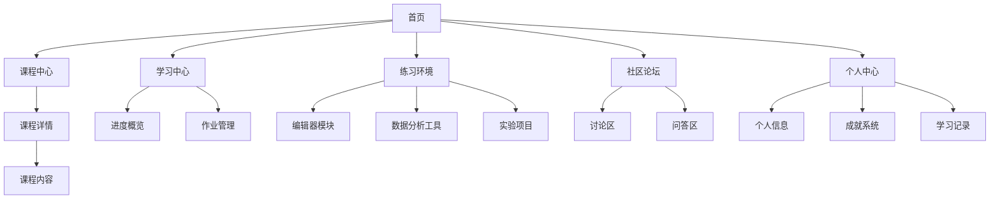

## 1. 产品概览
基于Python的数据分析在线教育平台，专为商务数据分析与应用专业的学生设计，提供完整的课程体系、互动式学习模块、学练测评一体化功能以及成就激励系统。
- 解决商务数据分析专业学生缺乏专业实践平台的问题，提供从理论学习到实践应用的全流程支持。
- 目标是成为商务数据分析专业学生的首选在线学习平台，帮助他们掌握Python数据分析技能，提高就业竞争力。

## 2. 核心功能

### 2.1 功能模块
我们的在线教育平台包含以下主要页面：
1. **首页**：平台介绍、课程分类展示、推荐课程、最新动态。
2. **课程中心**：完整课程体系，包含课程分类、筛选、详情查看。
3. **学习中心**：学习进度跟踪、课程管理、作业管理。
4. **练习环境**：Python在线编辑器、数据分析工具、实验项目。
5. **社区论坛**：学习讨论、问题解答、经验分享。
6. **个人中心**：个人信息管理、成就系统、学习记录。

### 2.2 页面详情

| 页面名称 | 模块名称 | 功能描述 |
|-----------|-------------|---------------------|
| 首页 | 英雄区 | 平台介绍、主要特色展示、快速导航入口 |
| 首页 | 课程分类 | 展示不同类别的课程，如Python基础、数据分析、可视化等 |
| 首页 | 推荐课程 | 基于用户兴趣和热门程度推荐课程 |
| 首页 | 最新动态 | 平台公告、新课程上线、活动信息 |
| 课程中心 | 课程列表 | 展示所有课程，支持按类别、难度筛选，按热度、时间排序 |
| 课程中心 | 课程详情 | 课程介绍、讲师信息、学习目标、前置要求、章节大纲、学生评价 |
| 课程中心 | 课程内容 | 视频播放器、学习资料、讨论区、进度跟踪 |
| 学习中心 | 进度概览 | 展示整体学习进度、当前学习课程、已完成课程 |
| 学习中心 | 作业管理 | 待完成作业、已提交作业、作业评分 |
| 练习环境 | 编辑器模块 | Python在线编辑器、代码执行、输出显示、示例代码 |
| 练习环境 | 数据分析工具 | 数据清洗、可视化、统计分析、数据导入导出 |
| 练习环境 | 实验项目 | 基于真实场景的数据分析项目，提供数据集和任务要求 |
| 社区论坛 | 讨论区 | 按课程、主题分类的讨论帖子，支持回复、点赞 |
| 社区论坛 | 问答区 | 问题发布、回答、采纳最佳答案 |
| 个人中心 | 个人信息 | 用户基本信息、账号设置、通知管理 |
| 个人中心 | 成就系统 | 学习成就、徽章、等级、排行榜 |
| 个人中心 | 学习记录 | 学习历史、课程完成情况、证书管理 |

## 3. Core Process

### 学生用户流程
1. **注册/登录**：学生通过邮箱/手机号注册账号，或使用第三方账号登录。
2. **浏览课程**：在首页和课程中心浏览推荐课程和分类课程。
3. **选择课程**：查看课程详情，了解课程内容和要求。
4. **开始学习**：进入课程内容页面，观看视频，阅读资料，参与讨论。
5. **完成练习**：在练习环境中使用Python编辑器和数据分析工具完成练习。
6. **提交作业**：完成课程作业并提交，等待评分。
7. **参与社区**：在社区论坛中提问、回答问题，分享学习经验。
8. **查看成就**：在个人中心查看学习成就和进度。

### 教师用户流程
1. **注册/登录**：教师通过邮箱注册账号，经过平台审核后获得教师权限。
2. **创建课程**：创建新课程，设置课程信息、章节内容、作业和评估标准。
3. **管理课程**：更新课程内容，回复学生讨论，批改作业。
4. **分析数据**：查看课程统计数据，了解学生学习情况。

## 4. 用户接口设计
### 4.1 设计风格
- **主色**：蓝色系(#165DFF)，代表专业、信任和科技感
- **辅色**：橙色(#FF7D00)，用于强调和交互元素
- **中性色**：白色(#FFFFFF)、浅灰(#F5F7FA)、中灰(#86909C)、深灰(#1D2129)
- **按钮样式**：圆角矩形，主按钮使用填充色，次按钮使用描边
- **字体**：系统默认无衬线字体，标题使用粗体，正文使用常规字重
- **布局样式**：基于卡片的模块化布局，清晰的视觉层次，响应式设计
- **图标样式**：线性图标，保持简洁现代的风格

### 4.2 页面设计概览

| 页面名称 | 模块名称 | UI元素 |
|-----------|-------------|-------------|
| 首页 | 英雄区 | 大型背景图，醒目标题和副标题，CTA按钮，简洁的功能介绍卡片 |
| 首页 | 课程分类 | 水平滚动的分类卡片，每个卡片包含图标和分类名称 |
| 首页 | 推荐课程 | 网格布局的课程卡片，包含课程图片、标题、简介、评分、价格 |
| 首页 | 最新动态 | 时间线样式的动态列表，包含标题、摘要、日期 |
| 课程中心 | 课程列表 | 侧边栏筛选器，顶部排序选项，网格布局的课程卡片，分页控件 |
| 课程中心 | 课程详情 | 顶部课程封面图，课程信息区域，标签式导航(详情、大纲、评价)，讲师信息卡片 |
| 课程中心 | 课程内容 | 左侧章节导航，右侧内容区域(视频播放器、文本内容)，底部讨论区 |
| 学习中心 | 进度概览 | 环形进度图，课程状态卡片，数据统计图表 |
| 学习中心 | 作业管理 | 作业列表，状态标签，提交按钮，评分反馈 |
| 练习环境 | 编辑器模块 | 代码编辑器(Monaco Editor)，执行按钮，输出控制台，示例代码下拉菜单 |
| 练习环境 | 数据分析工具 | 工具选择标签，数据上传区域，参数配置表单，结果展示区域 |
| 练习环境 | 实验项目 | 项目卡片，难度标识，完成状态，开始按钮 |
| 社区论坛 | 讨论区 | 帖子列表，分类标签，搜索框，发布按钮，回复计数 |
| 社区论坛 | 问答区 | 问题列表，已解决/未解决标识，回答计数，最佳答案标识 |
| 个人中心 | 个人信息 | 头像，基本信息表单，账号设置选项 |
| 个人中心 | 成就系统 | 徽章展示，等级信息，成就进度条，排行榜入口 |
| 个人中心 | 学习记录 | 时间线样式的学习历史，课程完成证书，技能图谱 |

### 4.3 自适应
- **桌面端**：完整功能展示，多列布局，侧边栏导航
- **平板端**：适当调整布局，保持核心功能，导航转为顶部或底部
- **移动端**：单列布局，汉堡菜单导航，简化某些复杂功能的展示
- **触摸交互**：优化按钮大小和间距，支持手势操作，确保在触摸设备上的良好体验
- **响应式断点**：
  - 移动端：< 768px
  - 平板端：768px - 1024px
  - 桌面端：> 1024px